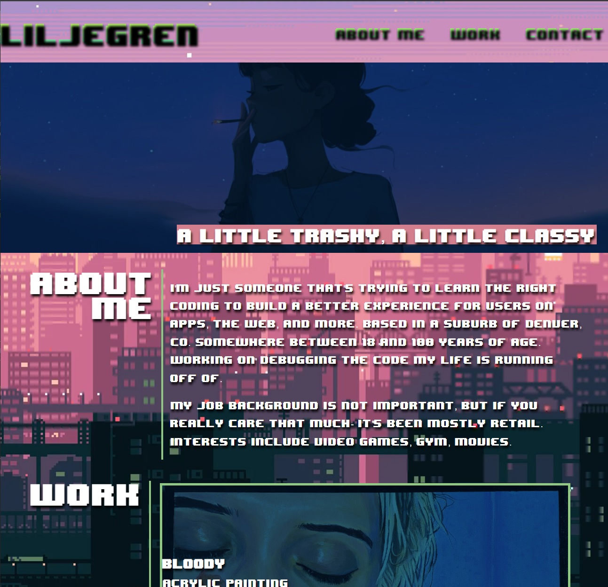
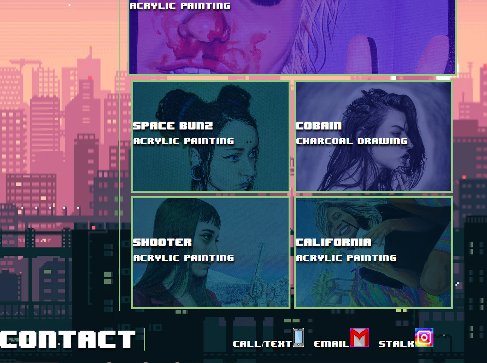

# puerto-de-folio

## Description

I wanted to make a page to show my artistic flair with coding, styling, and with literal art. This page is a way to view those things, as well as to get an idea of my interests.

Having an idea in mind- I was not able to fully complete what I wanted (yet), since I have limited coding experience. I learned that I still have much to learn.

## Usage

Simply open the page. The links at the top will take you to the separate sections on the page. The pictures are links and will take you to a new tab to view each picture full-size and individually. The icons on the bottom of the page will take you to a way to call me, email me, or view my Instagram.

## Credits

Here are some links to some of the art used on the site that is not my own:

https://wallpapercave.com/8-bit-japan-live-wallpapers
https://www.shutterstock.com/search/8-bit-phone
http://pixelartmaker.com/art/bb8c4ad4e731703
https://prohama.com/instagram-pattern-1/
https://knoef.info/trophy-guides/ps4-guides/river-city-girls-trophy-guide/

Got the instructions for how to use the font-family I want from here:

https://fontlibrary.org/en/font/8bit-wonder

## License

MIT License

Copyright (c) [2023] [d-lil]

Permission is hereby granted, free of charge, to any person obtaining a copy
of this software and associated documentation files (the "Software"), to deal
in the Software without restriction, including without limitation the rights
to use, copy, modify, merge, publish, distribute, sublicense, and/or sell
copies of the Software, and to permit persons to whom the Software is
furnished to do so, subject to the following conditions:

The above copyright notice and this permission notice shall be included in all
copies or substantial portions of the Software.

THE SOFTWARE IS PROVIDED "AS IS", WITHOUT WARRANTY OF ANY KIND, EXPRESS OR
IMPLIED, INCLUDING BUT NOT LIMITED TO THE WARRANTIES OF MERCHANTABILITY,
FITNESS FOR A PARTICULAR PURPOSE AND NONINFRINGEMENT. IN NO EVENT SHALL THE
AUTHORS OR COPYRIGHT HOLDERS BE LIABLE FOR ANY CLAIM, DAMAGES OR OTHER
LIABILITY, WHETHER IN AN ACTION OF CONTRACT, TORT OR OTHERWISE, ARISING FROM,
OUT OF OR IN CONNECTION WITH THE SOFTWARE OR THE USE OR OTHER DEALINGS IN THE
SOFTWARE.

## Screenshot

